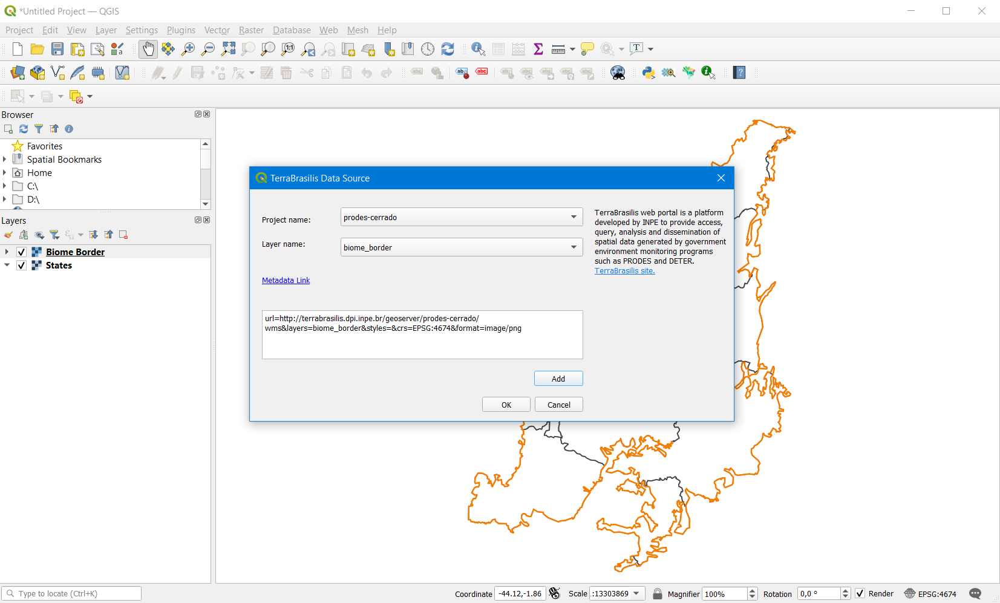

# TerraBrasilis Data Source - QGIS plugin

The QGIS plugin provides access to the WMS services of the Spatial Data Infrastructure TerraBrasilis. From the TerraBrasilis Data Source, select the project name and desired layer, and it will be possible to access the layer metadata and added the layer to the canvas. The layers are provided via WMS which requires an active internet connection.

# Getting Started

## Prerequisite

* QGIS version 3.0 or later

## Installation

### Install via official plugin repository in QGIS

1. This plugin is experimental, then in QGIS, navigate to menu **Plugins** > **Manage and Install Plugins...** > **Settings** > active **Show also experimental plugins**
2. Switch to tab **All**
2. Search for `TerraBrasilis Data Source` > **Install plugin**
3. Switch to tab **Installed**, make sure the plugin `TerraBrasilis Data Source` is enabled.

### In case of manual installation in QGIS

1. Download the [latest release](https://github.com/terrabrasilis/terrabrasilis_datasource/releases) zip file
2. In QGIS, navigate to menu **Plugins** > **Manage and Install Plugins...** > **Install from ZIP**, then select the zip file.
3. Switch to tab **Installed**, make sure the plugin `TerraBrasilis Data Source` is enabled.

## Usage

Once you have installed and enabled the plugin TerraBrasilis Data Source, it can be accessed via the toolbar or the menu **Plugins**. The main dialog contains a **Project name** with the projects separated by biomes, and **Layer name**, that dynamic refresh layers names according to the Project name combo box. When switch between layer names is enabled a **Metadata Link**, that contains a link to see information about the layer. Use **Add** button to add the geospatial map image within the current canvas.

## Development

1. Clone this repository.
2. Build the plugin by running `QGIS Plugin Builder`.

## License

This project is published under the GNU General Public License v3.0 license, see [LICENSE](./LICENSE) for details.

